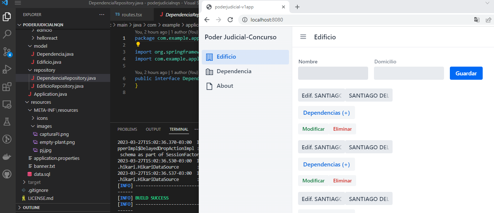

# Poder Judicial Neuquén

App para concurso externo Expte. Nº 0578-22

# Demo - App en java con Hilla + React
Una pequeña aplicación demo desarrollada en Java, utilizando el framework Hilla con Spring Boot y React: https://hilla.dev/docs/react. También se utilizó: Lombok: https://projectlombok.org/ Formix: https://formik.org/

## Empezando

Puedes clonar este proyecto desde `GitHub` usando el siguiente comando: 
```bash
git clone https://github.com/krozas/poderjudicialnqn.git

```

or podes crear un nuevo proyecto Hilla usando `Vaadin CLI` :

```bash
npx @vaadin/cli init --pjnqn-app
```

También puede crear un proyecto con la configuración de seguridad básica agregada usando el `--auth` option :

```bash
npx @vaadin/cli init --pjnqn-app --auth
```

## Correr la aplicacion

El proyecto es un proyecto Maven estándar. Para ejecutarlo desde la línea de comandos, tipear `mvnw` (Windows), o `./mvnw` (Mac & Linux), y luego abrir http://localhost:8080 en el navegador. Esto requiere tener Maven instalado.

También se puede importar el proyecto al IDE de elección como lo haría con cualquier Proyecto Maven.

## Deploying a Producción

Para crear una compilación de producción, ejecutar `mvnw clean package -Pproduction` (Windows), o `./mvnw clean package -Pproduction`  (Mac & Linux). Esto creará un archivo JAR con todas las dependencias y recursos front-end, listo para ser desplegado. El archivo se puede encontrar en la carpeta `target` después de que se complete la compilación.
Una vez que se construye el archivo JAR, se puede correr usando `java -jar target/myapp-1.0-SNAPSHOT.jar` (NOTE, reemplazar
`myapp-1.0-SNAPSHOT.jar` con el nombre de tu jar).

## Captura de pantalla del proyecto


 

## Información de la App

Edificio: Permite crear, modificar y eliminar edificios.

Dependencia: Permite crear, modificar y eliminar dependencias.

En ambos casos,  se muestran datos de edificios y dependencias ya cargados, se utilizó una base de datos en memoria.

## Estructura del Proyecto

<table style="width:100%; text-align: left;">
  <tr><th>Directory</th><th>Description</th></tr>
  <tr><td><code>frontend/</code></td><td>Client-side source directory</td></tr>
  <tr><td>&nbsp;&nbsp;&nbsp;&nbsp;<code>index.html</code></td><td>HTML template</td></tr>
  <tr><td>&nbsp;&nbsp;&nbsp;&nbsp;<code>index.ts</code></td><td>Frontend 
entrypoint, bootstraps a React application</td></tr>
  <tr><td>&nbsp;&nbsp;&nbsp;&nbsp;<code>routes.tsx</code></td><td>React Router routes definition</td></tr>
  <tr><td>&nbsp;&nbsp;&nbsp;&nbsp;<code>MainLayout.tsx</code></td><td>Main 
layout component, contains the navigation menu, uses <a href="https://hilla.dev/docs/react/components/app-layout">
App Layout</a></td></tr>
  <tr><td>&nbsp;&nbsp;&nbsp;&nbsp;<code>views/</code></td><td>UI view 
components</td></tr>
  <tr><td>&nbsp;&nbsp;&nbsp;&nbsp;<code>themes/</code></td><td>Custom  
CSS styles</td></tr>
  <tr><td><code>src/main/java/&lt;groupId&gt;/</code></td><td>Server-side 
source directory, contains the server-side Java views</td></tr>
  <tr><td>&nbsp;&nbsp;&nbsp;&nbsp;<code>Application.java</code></td><td>Server entry-point</td></tr>
</table>

## Enlaces utiles

- Leer la documentacion en [hilla.dev/docs](https://hilla.dev/docs/).
- Responder preguntas [Stack Overflow](https://stackoverflow.com/questions/tagged/hilla) o unite a [Discord channel](https://discord.gg/MYFq5RTbBn).
- Informar problemas, crear solicitudes de incorporación de cambios en [GitHub](https://github.com/vaadin/hilla).
